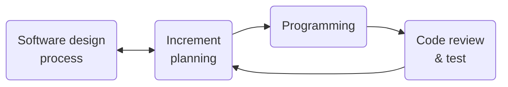

# What is it ?
Brain-down is an open-source software to:
- Create mind-map
- Brainstorm
- Whatever you find it useful for

It is designed aiming to create a tool that provide visual support to the reasoning activity involved in:
- Studying
- Note taking
- And again, whatever you find it useful for

 
 
 

# How to get it
\<Place holder: this section will be filled in accordance with the development of the Deployment feature, take a look to section [Road map](#road-map)\>

 
 
 

# Reason for it's existence
Many are the mind-mapping tools available on the market nowadays, they offer lots of feature and all have one in common, the price. The fact that they have paid plans doesn't represent a limit for all of them, indeed there are some good software that doesn't require you to pay to have access the "most important" feature: unlimited maps with unlimited nodes. Here you have a list of some of those software:
- [Ayoa](https://www.ayoa.com/) (My favorite mind-mapping software, successor of my beloved IMindMap)
- [MindNode](https://www.mindnode.com/) (Only available on Apple devices)

In addition the pay to use wall that most of the applications have, there are some features that usually get lost in the process, such as:
- Ability to render mathematical formulas (with languages such as [LaTex](https://www.latex-project.org/) of [Typst](https://typst.app/)) 
- Code rendering

For the above reasons I have decided to develop my own software for schematizing/mind-mapping/brainstorming, trying solving the problems identified above.

 
 
 

# Road map
| Version| Feature | Details |
| - | - | - |
| 0.1.0 | File handling | File operation: creation/renaming/deletion, File display |
| 0.2.0 | Vault handling | Vault represented by a name, Vault operation: creation/renaming/deletion, Set a default vault, Switch between Vault |
| 0.3.0 | Folder handling | Folder operation: creation/deletion, File movement |
| 0.4.0 | Project replicability | Create a script for project setup and docker image to allow others to test the software |
| 0.5.0 | Notes | Sticky notes based schema creation, Elements added: sticky note nodes, connections |
| 0.6.0 | Media library | Integration of openly available multimedia library to add icons, images and other type of media to the schemas |
| 0.7.0 | Mind-map | Mind-map node creation, Elements added: mind-map node|
| 0.8.0 | Mathematical formulas rendering | [Typst](https://typst.app/) based mathematical scripting |
| 0.9.0 | Code rendering | Dedicated styling display/rendering rules will be defined for code snippet |
| 0.10.0 | Export to image | Ability to export the created schemas with image format |
| 0.11.0 | Export to pdf | Ability to export the created schemas with pdf format |
| 1.0.0 | First stable version | Every functionality tested and ready to be used by everyone|

 
 
 

# Note on software process
## Approach
### Task division
| Task | How it is carried out |
| - | - |
| System design | Mainly human |
| Programming | Mainly AI |
| Code review | Human |

### Software process

## Reasons
To understand the reasons behind the approach that has been adopted, are worth mentioning the goals I have in mind this project:
- **Deliver**: Provide to the end user software feature as fast as I can.
- **Quality**: Provide to the end user a software that function correctly/as expected.
- **Efficiency**: Maximize time to result ratio.

Using an [AI-assisted pair programming](#ai-assisted-pair-programming) approach, I can deliver feature faster than I would do without, allowing me to focus more on code reviewing the product testing, to guarantee product behavior correctness. On top of that I'm a solo developer and, as up to now, a University student, therefore the time I have to spend behind the development of this software is limited, with this approach I can higher the amount of work done per unit of time. 

## My take on AI assisted development
I would like to start by making a distinction between two activity, that I feel are often confused:

### **Vibe coding**
I suggest you to read the [Wikipedia article](https://en.wikipedia.org/wiki/Vibe_coding) about it, it give you a good definition about what it is exactly. I want to report part of a Tweet, from Karpathy, "[...] you fully give in to the vibes, [...], and forget that the code even exists. [...] I ask for the dumbest things like "decrease the padding on the sidebar by half" because I'm too lazy to find it. I "Accept All" always, I don't read the diffs anymore. When I get error messages I just copy paste them in with no comment, [...]" [(Andrej Karpathy, February 3rd 2025, X (ex Twitter) post)](https://x.com/karpathy/status/1886192184808149383). I think that it resume really well the concept behind vibe coding, that appear to be a no-brainer process, where it is not even necessary to understand what AI is doing, and therefore the "developer" don't even know what is actually delivering (in the case the vibe coded software is actually delivered).

### AI-assisted pair programming
[Pair programming](https://en.wikipedia.org/wiki/Pair_programming) is a simple programming paradigm, within which code is written in pairs (pairs of people), one write the code, the other one reviews it at the same time as it is written, the roles are switched following time intervals. With this paradigm there is no one person that wrote the code, both of the part involved act towards the same goal, both reviewing and writing code. Now, if one of the sides of the pair is an AI model, then, in my opinion, we are talking about a variation of the original concept of the Pair programming, and we can call it "AI-assisted pair programming", that really closely resemble the process that Simon Willison describe as "If an LLM wrote every line of your code but you've reviewed, tested and understood it all, that's not vibe coding in my book - that's using an LLM as a typing assistant." [(Simon Willison, March 6th 2025, Simon Willison's Weblog)](https://simonwillison.net/2025/Mar/6/)

### Take home message
I don't want to sound pretentious since I'm a newbie in the field and we can say that I don't have a lot of experience, if not None, this have to be taken just as a point of view.

I do think that as Software engineer (I do cover this role in this project, since I do almost everything) part of our job is to make the right choice in accordance with the requirement we do have, there is not to much space for gut decisions. So, despite being a person with a bit of a prejudice towards AI-heavy software development, I do think that for this project the AI supported development was a prefect fit, as briefly explained in section [Note on software process/Reasons](#reasons).

AI assisted development don't have to be demonized. Many are the way of integrating AI in the software process, our job is to make it thoughtfully. If all the world is exited about AI, and, what basically AI does is imitating the human brain capability, maybe the human brain is cool. You have one built in, so use it!, don't take everything that AI says at face value, review, criticise, and test it. Give your brain AI as a tool, not as a substitute.
